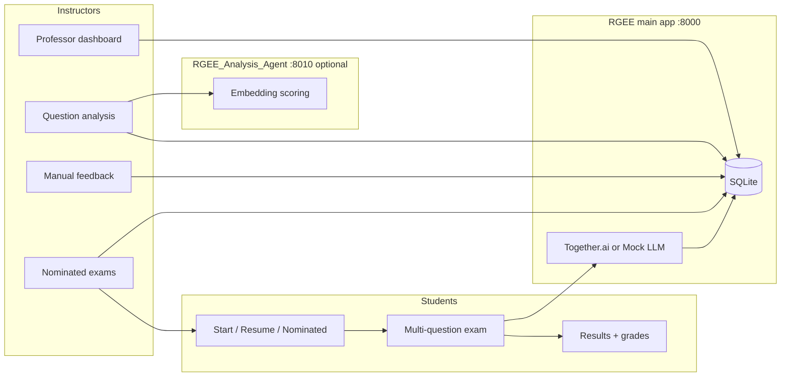

# RubricGuidedEssayExam (RGEE)

A web application for **adaptive, oral-style essay exams**: students answer questions tailored to a professor-provided domain; the system generates follow-up prompts, tracks time-on-question, and grades responses with an **LLM-assisted rubric**. Instructors review sessions, run **semantic question analysis** (embedding-based research codes), add **manual quality ranks**, publish **nominated exams** from scored questions, and compare **AI vs human** rankings in one dashboard.

## Team — GREEN

| | |
|---|---|
| WL | Anis, Sahrish |
| | Byrnes, Nikola · Dang, Kenny · Gervacio, Angeles · Lopez, Angela |
| | Maloney, Nigel · Mui, Ethan |
| WL | Prljic, Vojislav |
| | Reyna, Rodolfo · Sanchez, Ricardo · Tavassoli, Armin |

---

## What the system does



| Role | Capabilities |
|------|----------------|
| **Student** | Start a **generated** exam (topic, education level, rubric strictness) or a **nominated** exam (fixed questions + 8-character ID); **resume** an in-progress attempt (5-character exam code); optional accessibility (theme, dyslexia-friendly font, pointer size); math in prompts via **KaTeX** |
| **Instructor** | View sessions and per-question detail; configure **Together.ai** credentials (keychain / encrypted file / `.env` fallback); run **question analysis**; save **manual 1–4 ranks** and notes; publish **nominated exams**; developer **performance log** |

---

## Features

### Student exam flow

- **Multi-question exams** (1–20 questions) with context carried across questions in a session
- **Question generation** from a free-text professor domain plus prior questions in the session
- **Per-question grading** with rubric alignment and a **final aggregate grade** when the exam completes
- **Home page:** themed **Start exam** / **Resume exam**
  - **Generated:** customize topic, education level, and grading strictness
  - **Nominated:** student ID + **8-character** exam ID from the instructor (fixed question set from analysis)
  - **Resume:** student ID + **5-character** code for an attempt already in progress
- **Hints** and optional **client timing** telemetry (performance log)
- **Math rendering:** LaTeX in question text and previews (`$...$`, `$$...$$`, `\(...\)`, `\[...\]`) via shared KaTeX assets

### Instructor dashboard

- **Session list** and **per-session detail** (prompts, student answers, grades, rationales)
- **Together.ai credentials** page: prefer OS secure storage; encrypted fallback; optional `.env` `TOGETHER_API_KEY` for Docker/CI; clearing credentials also strips the key from project `.env` when present
- **Mock vs Production LLM** per exam (and filters on analysis)

### Question analysis (semantic scoring)

Instructor tool at `/professor/question-analysis` (does **not** auto-run on page load — set filters and click **Run analysis**).

**AI ranking (embedding-based)**

- **Coding scheme #1 — Essay question quality** (1–4): match each prompt to rubric tier anchors in embedding space
- **Coding scheme #2 — Grade appropriateness** (1–4): same method for level fit
- **Supplementary 0–10 signals:** relevance (vs domain bundle), embedding quality, humor/levity vs neutral tone
- Per-question **rationales** and notes; **category tables** and **Chart.js** dashboard (donuts, bar charts, single-session line chart when one session is in the filter)
- **Compare-by** slices: education level, LLM mode, session id, quality code, grade appropriateness code

**Manual ranking (instructor)**

- Separate page: `/professor/question-analysis/manual-feedback`
- **Signal bars (1–4)** for quality (Qly) and appropriateness (Lvl) beside each question; click or drag to set; click again to clear
- Persists `manual_quality_code`, `manual_grade_appropriateness_code`, and instructor notes in `QuestionAnalysisFeedback`

**In-page view switcher (no extra navigation)**

On the analysis results dashboard, use the pills beside **Analysis overview**:

| View | What updates in place |
|------|------------------------|
| **AI ranking** | Default charts and tables driven by embedding codes and 0–10 signals |
| **Manual ranking** | Charts/tables from saved instructor ranks only (where set) |
| **Compare** | Side-by-side AI vs manual frequencies, delta histogram (manual − AI), agreement %, category agreement columns, per-card compare strip with Δ |

Implementation: `chart_payload.views` (server) + `question_analysis_charts.js` + `analysis_view_switcher.js` (client). No full page reload when switching views.

**Nominated exams**

- After analysis, open **Nominated exams** to select questions (manual feedback notes can flow into student-facing copy), publish, and share the **8-character** access code
- Analysis summary notes how many sessions in the current filter already have a nominated exam published

### Optional analysis agent

- **RGEE_Analysis_Agent** — separate FastAPI service (default port **8010**) for heavy embedding work
- When `RGEE_ANALYSIS_AGENT_URL` is set, the main app delegates scoring over HTTP so the exam server does not load PyTorch
- `./start.sh` starts agent + main app together and wires the URL into `.env` when missing

### Development and ops

- **Mock LLM** (`MOCK_LLM=1`) for local demos without API keys (defaulted by launch scripts when unset)
- **Docker Compose** for main app + agent
- **pytest** suite with isolated temp SQLite and mock LLM

---

## Repository layout

```
RubricGuidedEssayExam/
├── app/                          # Main FastAPI application
│   ├── main.py                   # Routes: exam, professor, analysis, nomination
│   ├── database.py               # SQLAlchemy models + migrations
│   ├── llm_service.py            # Together.ai / mock completions
│   ├── question_analysis.py      # Embedding codes, chart/view payloads
│   ├── question_analysis_support.py  # Shared analysis page context
│   ├── analysis_agent_client.py  # HTTP client for analysis agent
│   ├── together_credentials.py   # Secure + .env credential handling
│   └── ...
├── RGEE_Analysis_Agent/          # Optional parallel scoring service
│   └── app/
├── templates/                    # Jinja2 HTML (student, professor, analysis)
├── static/                       # CSS, JS (charts, view switcher, manual ranks, KaTeX)
├── assets/                       # Images, fonts (e.g. OpenDyslexic)
├── scripts/
│   ├── launch_project.sh         # Main app only
│   ├── launch_analysis_agent.sh
│   ├── start_project.sh          # Agent (bg) + main (fg)
│   └── recreate_venv.sh          # Python 3.12 venv + analysis deps
├── start.sh                      # Wrapper → start_project.sh
├── tests/                        # pytest (general/, conftest.py)
├── docker-compose.yml
├── requirements.txt
└── requirements-analysis.txt     # PyTorch / sentence-transformers (optional)
```

---

## Stack

| Layer | Technology |
|-------|------------|
| Runtime | Python **3.11+** ( **3.12 recommended** for analysis wheels) |
| Web | **FastAPI**, **Uvicorn**, **Jinja2** |
| Data | **SQLAlchemy**, **SQLite** by default (`DATABASE_URL` overridable) |
| LLM | **Together.ai** chat completions (or mock) |
| Analysis | **sentence-transformers** / **PyTorch** (in-process or via agent); **pandas** summaries; **Chart.js** dashboards |
| Math UI | **KaTeX** (CDN) + `static/math-typeset.js` |
| Front-end | Vanilla JS modules; theme + accessibility toggles |

---

## Data model (main database)

| Table | Purpose |
|-------|---------|
| `Student` | Student identifiers |
| `ExamSession` | One exam attempt (domain, level, mock/production, codes) |
| `ExamQuestion` | Generated prompts and background per question |
| `FinalGrade` | Aggregate grade when exam completes |
| `QuestionAnalysisFeedback` | Instructor note + **manual_quality_code** / **manual_grade_appropriateness_code** (1–4) |
| `NominatedExam` / snapshots | Published fixed exams from analysis selections |
| `PerformanceLog` | HTTP / timing diagnostics |

The analysis agent may use its own SQLite file under `RGEE_Analysis_Agent/` when run standalone.

---

## Prerequisites

- **Python 3.11+** for the core app; **3.12 (recommended)** if you install **sentence-transformers / PyTorch** for instructor question-analysis (wheels often **do not exist for bleeding-edge releases like 3.14** yet). Check with `python3 --version` (macOS/Linux) or `py -3 --version` / `python --version` (Windows).
- **Git** (to clone the repository).

### Fresh venv with analysis dependencies (macOS/Linux)

```bash
chmod +x scripts/recreate_venv.sh
./scripts/recreate_venv.sh
```

Removes `.venv`, recreates it with Python 3.12 (or next-best 3.11/3.13 on PATH), and installs `requirements.txt` plus **`requirements-analysis.txt`**.

---

## How to run

Default URLs: main app **http://127.0.0.1:8000**, analysis agent **http://127.0.0.1:8010** (when started).

| Page | URL |
|------|-----|
| Student / home | http://127.0.0.1:8000/ |
| Start — generated vs nominated | http://127.0.0.1:8000/start |
| Generated exam setup | http://127.0.0.1:8000/start/generated |
| Nominated exam (8-char ID) | http://127.0.0.1:8000/start/nominated |
| Resume (5-char code) | http://127.0.0.1:8000/resume |
| Professor dashboard | http://127.0.0.1:8000/professor |
| Developer tools | http://127.0.0.1:8000/professor/tools |
| Question analysis | http://127.0.0.1:8000/professor/question-analysis |
| Manual feedback | http://127.0.0.1:8000/professor/question-analysis/manual-feedback |
| Nominated exams | http://127.0.0.1:8000/professor/question-analysis/nomination |
| Together credentials | http://127.0.0.1:8000/professor/together-credentials |
| Performance log | http://127.0.0.1:8000/performance-log |
| API docs (Swagger) | http://127.0.0.1:8000/docs |
| Agent health (if running) | http://127.0.0.1:8010/health |

### macOS / Linux (recommended)

1. Clone the repo and `cd` to the project root.

2. **One-command startup (main + analysis agent)** — best for full instructor analysis locally:

   ```bash
   chmod +x start.sh scripts/start_project.sh scripts/launch_project.sh run_dev.sh scripts/launch_analysis_agent.sh
   ./start.sh
   ```

   - Starts **RGEE_Analysis_Agent** on **8010** (background), waits until it responds
   - Sets **`RGEE_ANALYSIS_AGENT_URL`** in `.env` if missing
   - Starts the **main app** on **8000** with reload
   - Logs: `.rgee-run/analysis-agent.log` (gitignored)
   - **Ctrl+C** stops both processes

3. **Main app only** (creates `.venv` if needed, installs deps, optional `.env`, then Uvicorn):

   ```bash
   ./scripts/launch_project.sh
   ```

   - Sets **`MOCK_LLM=1`** by default when unset
   - If **`RGEE_ANALYSIS_AGENT_URL`** is set, question analysis calls the agent instead of in-process embeddings

4. **Faster re-runs** (main only, after `.venv` exists):

   ```bash
   ./run_dev.sh
   ```

5. **Environment file:**

   ```bash
   cp .env.example .env
   ```

   Key variables (see `.env.example` for full list):

   | Variable | Purpose |
   |----------|---------|
   | `MOCK_LLM` | `1` = mock questions/grades; `0` = production when key present |
   | `TOGETHER_API_KEY` | Optional fallback API key (prefer instructor credentials UI) |
   | `RGEE_ANALYSIS_AGENT_URL` | e.g. `http://127.0.0.1:8010` — delegate embedding scoring |
   | `RGEE_ANALYSIS_AGENT_SECRET` | Optional shared secret with agent |
   | `INSTRUCTOR_SESSION_SECRET` | Cookie signing for professor login |
   | `DATABASE_URL` | Override SQLite path (Docker uses `/data/...`) |

6. **Ctrl+C** stops the server (or both services if you used `./start.sh`).

### Analysis agent only (second terminal)

```bash
./scripts/launch_analysis_agent.sh
```

Set on the main app:

```bash
RGEE_ANALYSIS_AGENT_URL=http://127.0.0.1:8010
```

For **live** embeddings (not mock), use a Python with PyTorch wheels and set `RGEE_MOCK_QUESTION_ANALYSIS=0` on the agent.

### Docker (main + agent)

```bash
docker compose up --build
```

- Main: http://localhost:8000  
- Agent health: http://localhost:8010/health  

Mount credentials or set instructor auth via environment as in `.env.example`.

### Manual Uvicorn (after `source .venv/bin/activate`)

```bash
export MOCK_LLM=1
uvicorn app.main:app --reload --reload-dir app --reload-dir templates --reload-dir static --reload-dir assets --host 127.0.0.1 --port 8000
```

### Windows

Use **Git Bash** for `./scripts/launch_project.sh` and `./run_dev.sh`, or create `.venv`, `pip install -r requirements.txt`, copy `.env`, and run Uvicorn with the same `--reload-dir` flags as above (`set MOCK_LLM=1` in CMD or `$env:MOCK_LLM = "1"` in PowerShell).

---

## Instructor workflow (typical)

1. Sign in at `/professor` (credentials from env or `instructor_credentials.json` on first setup).
2. Optionally save **Together.ai** key at `/professor/together-credentials` for production exams.
3. Students complete exams (or use mock data locally).
4. Open **Question analysis** → set filters → **Run analysis**.
5. Switch **AI ranking / Manual ranking / Compare** on the dashboard to explore results.
6. Open **Manual feedback** to set 1–4 bars and notes where AI codes need human review.
7. Open **Nominated exams** to publish a fixed exam from selected questions; share the 8-character ID with students.

---

## Tests

From the repository root (`.venv` with `requirements.txt` installed):

```bash
.venv/bin/python -m pytest tests/ -v
```

Tests use **mock LLM** and an **isolated temporary SQLite database** (`tests/conftest.py`). They do not require Together.ai keys or a live analysis agent unless a test sets `RGEE_ANALYSIS_AGENT_URL` with a mocked HTTP client.

Focused suites:

- `tests/general/test_api.py` — HTTP flows, analysis dashboard, manual rank persistence
- `tests/general/test_analysis_views_payload.py` — AI / manual / compare payload builders
- `tests/general/test_analysis_agent_integration.py` — agent delegation

---

## License

Add your license here if you publish the repo publicly.
